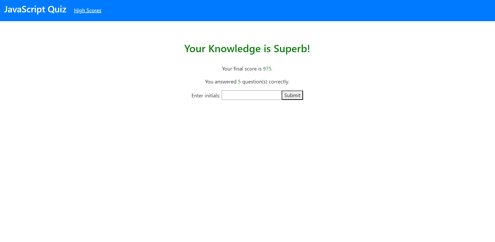

This project is a multiple-choice quiz with questions about some JavaScript basics.  It features an index page with three sections, which appear one after another with click events.  Once users finish the quiz, they will receive a score and can enter their initials, which will then be stored as an object in the local storage.

https://github.com/raytieu/code-quiz
https://raytieu.github.io/code-quiz/
